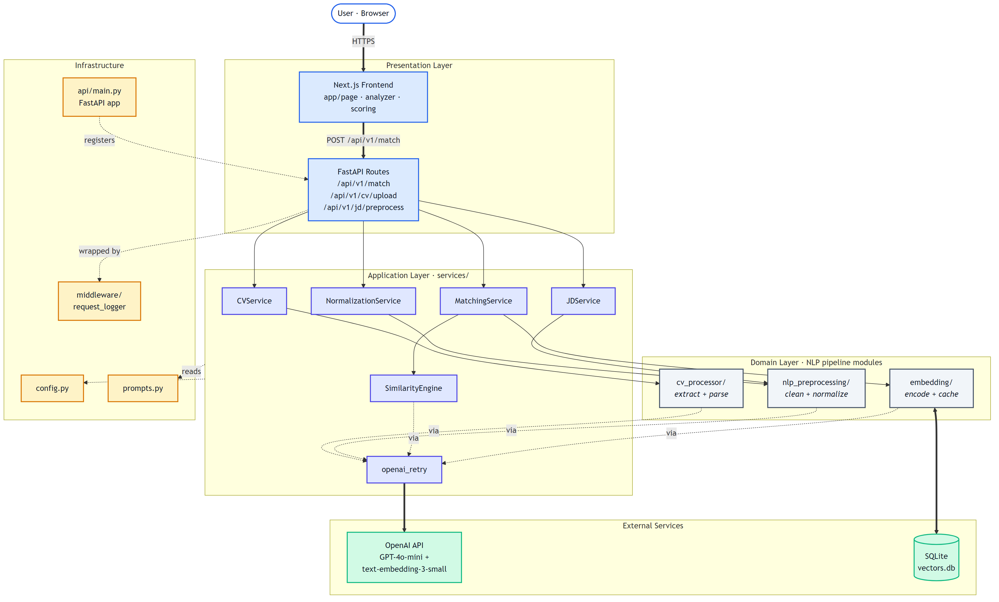
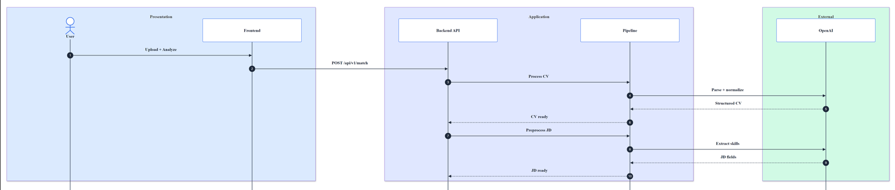
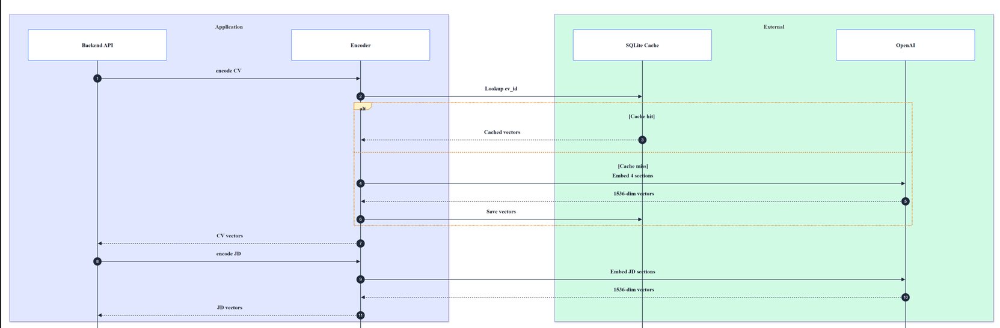
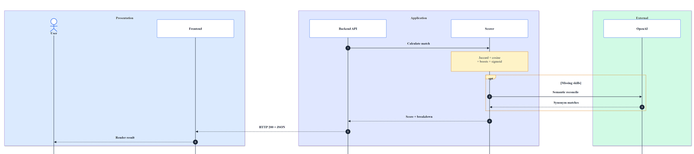
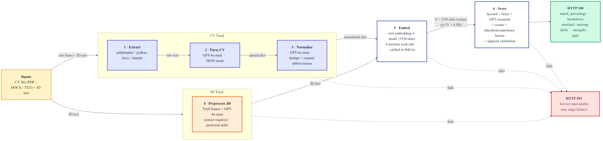

# CVMatch — Architecture Diagrams

Three complementary views of the system:

1. **Layered architecture** — who lives where
2. **Request sequence** — what happens on a single `/api/v1/match` call
3. **NLP pipeline** — the pipes & filters core

All diagrams are rendered PNGs stored under `docs/diagrams/`. Source Mermaid
files (`.mmd`) sit alongside each image so they can be edited and
re-rendered — see the regeneration commands at the bottom of this file.

---

## 1. Layered architecture

CVMatch is a **layered modular monolith** with a **pipes-and-filters NLP
pipeline** at its core, exposed via **REST**. Each layer only talks to
the layer directly below.

**Key points:**

- **Presentation** receives HTTP, returns JSON — nothing else lives here.
- **Application** (`services/`) contains the orchestration logic. Each
  service is one responsibility.
- **Domain** (`cv_processor`, `nlp_preprocessing`, `embedding`) holds the
  actual NLP work. Swappable — you could replace the OpenAI embedder with
  Sentence-BERT without touching the layers above.
- **Infrastructure** is cross-cutting: config, prompts, logging middleware,
  the FastAPI app itself.
- **External services** sit at the bottom — everything eventually funnels
  through the retry wrapper before hitting OpenAI.

---

## 2. Request sequence — a single `/api/v1/match` call

Shows exactly who calls who, in order, when a user clicks **Analyze**. Split
into three slide-sized panels for readability.

### 2a. Input processing

From the user clicking Analyze through CV parsing, CV normalization, and JD
preprocessing.

### 2b. Embedding with cache

How `HybridEncoder` looks up the CV in SQLite, either returns cached vectors
or makes the embedding call, then processes the JD side.

### 2c. Scoring and response

The `SimilarityEngine` calculation, optional semantic-reconciliation call,
and the final response back to the browser.

**What to read out of these:**

- Up to **6 OpenAI calls per request**: 3× chat (parse, normalize, JD
  extract) + 2× embedding batches + 1× optional semantic reconciliation.
- **Cache hit** skips the CV embedding call (panel 2b, Cache hit branch),
  dropping total latency from ~2 s to ~0.5 s.
- Any failure in the OpenAI calls is caught by the route handler and
  returned as HTTP 503 — no half-computed scores leak to the user.

---

## 3. NLP pipeline — pipes & filters

The six-stage transformation from raw upload to final score. Each stage
is an independent filter with a clear input → output contract.

**What to read out of this:**

- **Two parallel tracks converge at stage 5** — the CV track (stages 1–3)
  and the JD track (stage 4) both produce text that gets embedded
  together.
- **Stage 6 (scoring) is the only stage with multiple sub-steps**:
  Jaccard skills → fuzzy leftovers → GPT reconciliation → cosine
  similarity on 4 sections → education + experience boosts → weighted
  sum → sigmoid → band lookup.
- **Every stage has the same failure contract**: raise exception →
  route handler returns HTTP 503 with a clean retry message.

---

## One-line architecture description

If a reviewer asks what pattern you're using, here's the answer:

 **"Layered modular monolith with a pipes-and-filters NLP pipeline at
its core, exposed via REST."**

- **Layered** — presentation / application / domain / infrastructure
- **Modular monolith** — one process, strict module boundaries (no microservices)
- **Pipes & filters** — the six-stage pipeline where each stage is an independent filter
- **REST** — the external API style

## What it is **not**

- Not microservices (one backend process)
- Not event-driven (synchronous request/response)
- Not MVC (no ORM-backed models)
- Not serverless (long-running uvicorn)

---

